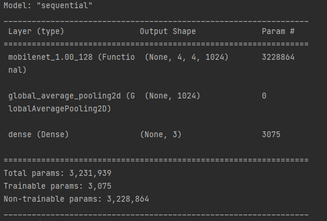
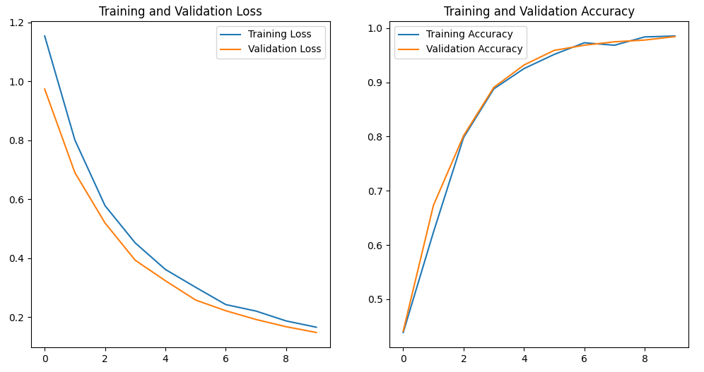
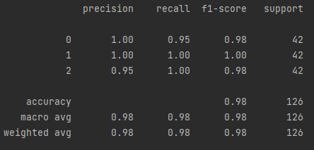
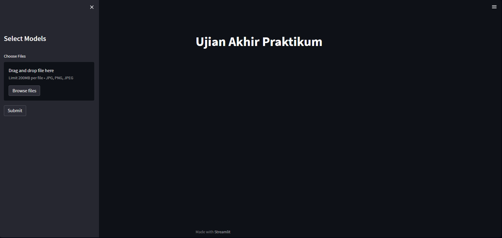
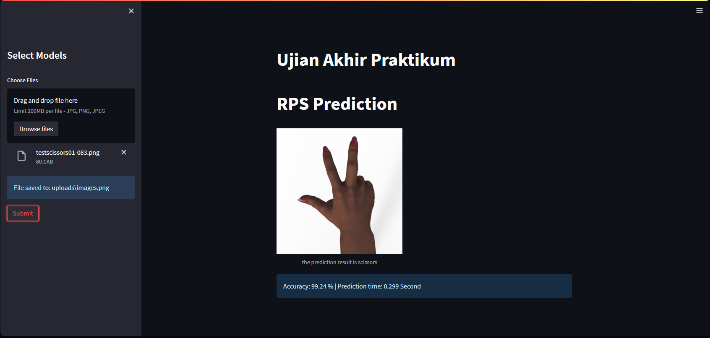

# RPS Classification

## Overview Problems
Permasalahan dari project ini yaitu bagaimana cara membuat model dengan akurasi bagus dari dataset RPS

    

## Overview Dataset
Dataset ini sudah tersedia pada website tensorflow, dataset dibagi menjadi 70% training, 25% validation, 5% testing. link url untuk download dataset: https://storage.googleapis.com/laurencemoroney-blog.appspot.com/rps.zip

## Preprocessing and Modeling
Pada bagian preprocessing data di rescale 1/255 lalu rotasi, zoom, shear, shift dengan masing-masing 20%, random flip dan fill nearest setelah rotasi dan shift

Untuk model kami menggunakan model _MobileNet_ dan ini adalah ilustrasi bagaimana _MobileNet_ berkerja

Summary Model:

Graph accuracy dan loss model:

Evaluate Model:

## Prediction and Deployment

Kami mengambil 10 image acak dari testing dan memperhatikan apakah model dapat memprediksi image dengan baik, berikut ini adalah hasilnya:

Deployment kami menggunakan streamlit dan berikut ini contohnya:

